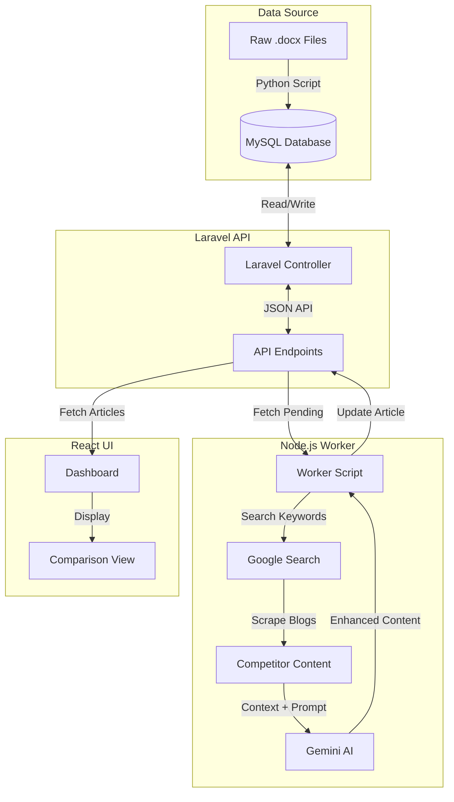

Here is the clean README content without any emojis, ready for you to copy.

```markdown
# AI Content Improver


A monolithic application that automates the process of enhancing content. It ingests raw articles, scrapes the web for real-time competitor insights, and uses Generative AI to rewrite and improve the content with citations.

---

## Architecture & Data Flow



---

## Prerequisites

Ensure you have the following installed on your machine:

* **Docker Desktop** (For MySQL & phpMyAdmin)
* **Node.js** (v18 or higher) & **npm**
* **PHP** (v8.2 or higher) & **Composer**
* **Python 3.x** (For data ingestion)

---

## Setup Instructions

### 1. Database Setup (Docker)

Start the database container.

```bash
# In the root directory
docker-compose up -d

```

* **Database:** `127.0.0.1:3306`
* **User/Pass:** `root` / `rootpassword`
* **GUI:** [http://localhost:8080](https://www.google.com/search?q=http://localhost:8080)

### 2. Backend Setup (Laravel)

The backend handles the data and API logic.

```bash
cd backend

# 1. Install Dependencies
composer install

# 2. Environment Setup
cp .env.example .env
# Open .env and ensure these values match Docker:
# DB_CONNECTION=mysql
# DB_HOST=127.0.0.1
# DB_PORT=3306
# DB_DATABASE=content_improver
# DB_USERNAME=root
# DB_PASSWORD=rootpassword

# 3. Generate App Key & Migrate
php artisan key:generate
php artisan migrate

# 4. Start Server
php artisan serve

```

* **API Health Check:** `http://127.0.0.1:8000/api/articles`

### 3. Frontend Setup (React)

The user interface for viewing articles.

```bash
cd frontend

# 1. Install Dependencies
npm install

# 2. Environment Setup
# Create a .env file (optional if using defaults)
# VITE_API_URL=[http://127.0.0.1:8000/api](http://127.0.0.1:8000/api)

# 3. Start Dev Server
npm run dev

```

* **App URL:** `http://localhost:5173`

### 4. Worker Setup (Node.js)

The automation script that scrapes Google and calls the AI.

```bash
cd worker

# 1. Install Dependencies
npm install

# 2. Environment Setup
# Create a .env file:
# GEMINI_API_KEY=your_google_ai_key_here
# API_URL=[http://127.0.0.1:8000/api](http://127.0.0.1:8000/api)

# 3. Run the Worker
node index.js

```

### 5. Data Ingestion (Python)

Import your raw `.docx` files into the database.

```bash
# In the root directory
python3 -m venv venv
source venv/bin/activate  # (Windows: venv\Scripts\activate)
pip install python-docx mysql-connector-python

# Place your .docx files inside an /articles folder
python import_docs.py

```

---

## Common Issues & Troubleshooting

### 1. Gemini API Errors (429 or 404)

* **429 Too Many Requests:** The generic "Free Tier" has limits (RPM/TPM).
* *Fix:* The worker script includes a retry mechanism. Wait ~60 seconds and try again, or upgrade to a paid API key.


* **404 Model Not Found:** You might be requesting a model version not available in your region.
* *Fix:* Update `worker/index.js` to use `gemini-2.0-flash` or `gemini-1.5-flash-latest`. Run `node check_models.js` to see available models.


### 2. Google Search Returns No Results

* **Issue:** Searching for a very specific, unique article title (e.g., "My Draft Article v1") yields 0 results.
* **Fix:** The worker script automatically truncates the search query to the first 5 keywords. Ensure your article titles contain searchable keywords (e.g., "Future of Chatbots").

### 3. "Module type" Warnings in Node

* **Issue:** `Warning: Module type of file... is not specified`.
* **Fix:** Ensure `worker/package.json` contains `"type": "module"`.

### 4. CORS Errors in Frontend

* **Issue:** Browser console shows `Access-Control-Allow-Origin` error.
* **Fix:**
1. Go to `backend/config/cors.php`.
2. Ensure `'paths' => ['api/*', 'sanctum/csrf-cookie']`.
3. Ensure `'allowed_origins' => ['*']` or specifically `['http://localhost:5173']`.
4. Run `php artisan config:clear`.


### 5. Database Connection Refused

* **Issue:** `SQLSTATE[HY000] [2002] Connection refused`.
* **Fix:** Ensure you use `DB_HOST=127.0.0.1` in your `.env` file instead of `localhost`. Docker mapping works better with the IP address on some systems (especially macOS).

---

## Tech Stack Details

| Component | Technology | Description |
| --- | --- | --- |
| **Backend** | Laravel 11 | REST API, Model Management, MySQL Interface |
| **Frontend** | React + Vite | Dashboard UI, Markdown Rendering, Axios Data Fetching |
| **Styling** | Tailwind CSS v3 | Utility-first CSS framework |
| **Database** | MySQL 8.0 | Running in Docker container |
| **Automation** | Node.js | Async worker service |
| **Scraping** | Puppeteer | Headless browser for Google Search |
| **Parsing** | Cheerio | Lightweight HTML parser for blog content |
| **AI Model** | Gemini 2.0 Flash | Content generation and rewriting |

---

```

```